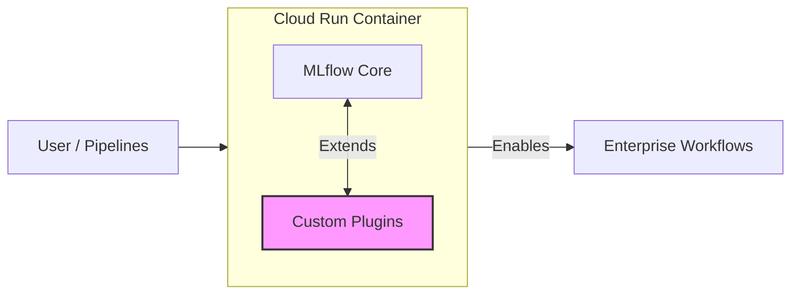
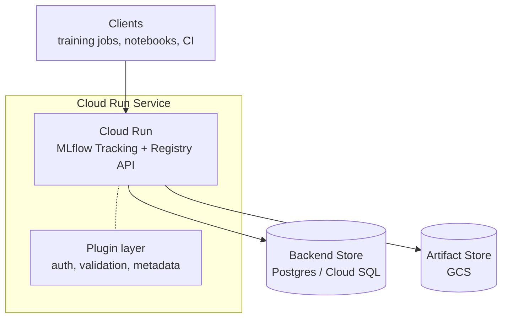
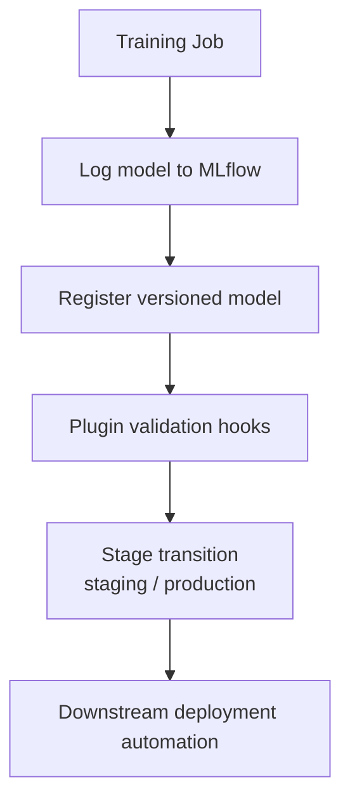

# MLflow in Production on Cloud Run  

### Tracking, Registry, and Plugin-Based Extensions

These notes describe a production-grade ML platform setup where **MLflow tracking and model registry**
are deployed as a **Cloud Run service**, and extended via **custom plugins** to support
enterprise workflows.

The emphasis is on **system architecture, extensibility, and operational tradeoffs** rather than
tutorial-style deployment.

---

## Problem Statement

Out-of-the-box MLflow works well for:
- local experimentation
- small teams
- notebook-driven workflows

It begins to break down when requirements include:
- centralized tracking across multiple teams
- custom authentication, metadata, and validation
- controlled model promotion and governance
- cloud-native scalability and reliability

This architecture addresses those gaps while keeping MLflow upgradeable.

---

## High-Level Architecture

**Key idea:** MLflow operates as a **stateless control plane**, not a monolithic ML system.

---

## Why Cloud Run

Cloud Run was chosen because it provides:
- **Stateless HTTP execution**
- Automatic horizontal scaling (including scale-to-zero)
- Native IAM integration
- Simple container-based deployment
- Cost efficiency for bursty and spiky traffic

This fits MLflow well because:
- MLflow APIs are request/response oriented
- All state lives in external systems
- Training workloads are fully decoupled

---

## Core Components

### 1. MLflow Tracking Server
- Exposes REST APIs for:
  - experiment management
  - run tracking
  - parameter and metric logging
- Runs as a containerized, stateless service
- Makes no assumptions about local filesystem persistence

---

### 2. Backend Store
Responsible for:
- experiment metadata
- runs
- parameters and metrics
- model registry state

Typical implementations:
- Cloud SQL (Postgres)
- Managed MySQL

Key requirements:
- strong transactional guarantees
- schema stability across upgrades
- automated backups and recovery

---

### 3. Artifact Store
Responsible for:
- model artifacts
- checkpoints
- feature snapshots
- evaluation outputs

Typical choice:
- Google Cloud Storage (GCS)

Design notes:
- artifacts are referenced by URI
- artifacts are never served directly by the MLflow service
- access is controlled via IAM or signed URLs

---

## Plugin-Based Extension Model

MLflow plugins are used to **extend core behavior without forking MLflow**.

### Why Plugins
- Avoid long-lived forks of upstream MLflow
- Preserve a clean upgrade path
- Isolate organization-specific logic
- Treat governance as a first-class concern

---

### Common Plugin Responsibilities

#### Authentication & Authorization
- Validate caller identity
- Enforce experiment- and registry-level access
- Integrate with cloud IAM or internal identity systems

#### Metadata Enrichment
- Attach required contextual metadata:
  - git SHA
  - training job ID
  - dataset or feature version
- Enforce mandatory tagging policies

#### Registry Controls
- Validate model registration and stage transitions
- Enforce promotion rules (e.g., staging → production)
- Block unsafe or non-compliant transitions

#### Audit & Observability
- Emit structured audit logs
- Track registry actions and transitions
- Support compliance and forensic analysis

---

## Model Registry Workflow

Typical promotion flow:

**Key principle:**  
> The model registry is a **control surface**, not just a metadata store.

---

## Integration with Training Pipelines

MLflow clients are invoked from:
- batch training jobs
- CI pipelines
- scheduled workflows

Key design decisions:
- clients authenticate using short-lived credentials
- training jobs never access databases directly
- all interactions flow through the MLflow API

This enforces:
- consistency
- auditability
- centralized policy enforcement

---

## Operational Considerations

### Scalability
- Cloud Run autoscaling absorbs bursty metric logging traffic
- Database connection pooling is critical
- Artifact uploads occur out-of-band from request paths

### Reliability
- Stateless service enables fast restarts and redeployments
- Backend store is the primary SPOF
- Health checks and alerts focus on:
  - API latency
  - error rates
  - database connectivity

### Security
- No public access to artifacts
- IAM-scoped service accounts for all components
- Plugins act as policy enforcement boundaries

---

## Tradeoffs & Limitations

### Pros
- Cloud-native and cost-efficient
- Highly extensible without forking MLflow
- Clear separation between control plane and data plane
- Evolves cleanly as governance needs grow

### Cons
- Plugin APIs are lightly documented
- Debugging plugin behavior requires MLflow internals familiarity
- Registry workflows still require process discipline and tooling

---

## Interview Takeaways

Key points to emphasize in interviews:
- MLflow functions as a **metadata and control plane**, not a training system
- Plugins enable enterprise governance without upstream divergence
- Cloud Run is well-suited for stateless ML control services
- Most real-world ML complexity lies in **data, serving, and governance**

---

## TL;DR

- MLflow runs as a stateless service on Cloud Run
- Metadata lives in SQL; artifacts live in object storage
- Plugins enforce auth, validation, and policy
- The registry acts as a production gate
- Designed for scale, auditability, and fast iteration

---

*These notes reflect a real production ML platform, not a tutorial deployment.*